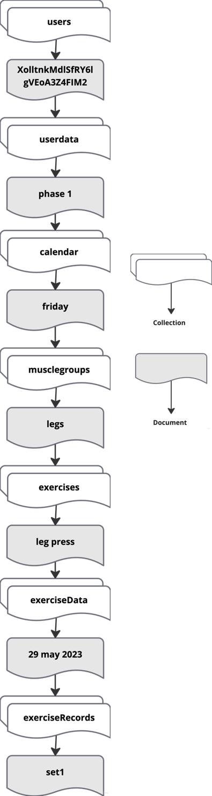

# RepJournal

RepJournal is an Android workout logging application built in Java as part of my **CI660 Advanced Mobile Application Development** module during my BSc Computer Science degree at the University of Brighton.

The app was designed to help users plan workout phases, organise weekly training days, log exercises, record sets/reps/weights, view workout history and track weekly progress through simple visual summaries. It uses **Firebase Authentication** for account access and **Cloud Firestore** to store user-specific workout data.

This project achieved **85/100 (A+)** and represents one of my strongest examples of individual mobile application development, cloud-backed data storage, authentication, UI/UX design and self-directed technical learning.

## Project Context

RepJournal was originally developed as an individual university project with the goal of creating a practical fitness tracking app that went beyond basic form input. The main focus was to design a smooth workout logging experience where users could move naturally from planning a training phase to recording actual exercise performance.

The project gave me hands-on experience with Android development in Java, Firebase Authentication, Firestore data modelling, fragment-based navigation, custom dialogs, RecyclerView-based data display, profile management and simple progress visualisation.

In 2026, I revisited the repository as part of my software engineering portfolio preparation. The recent work focuses on improving the GitHub presentation of the original project by adding clearer documentation, screenshots, technical explanations and a more professional README structure. The core application remains the original university project.

## Key Features

### Secure User Authentication

RepJournal uses **Firebase Authentication** to support account creation, login and email verification. Users must be authenticated before accessing the main workout tracking features, which gives the app a more realistic user-account structure than a simple local-only fitness tracker.

### Cloud-Based Workout Data Storage

Workout data is stored in **Cloud Firestore**, with each user having their own nested data structure for phases, weekdays, muscle groups, exercises and recorded sets. This allowed the app to persist user data across sessions and separate each user’s workout records securely.

### Workout Phase Planning

Users can create workout phases to organise their training over time. Each phase contains a weekly structure from Monday to Sunday, allowing users to plan different muscle groups and exercises for different training days.

### Weekly Training Calendar

The app provides a weekday-based flow where users can select a specific day and manage the workout assigned to that day. This makes the app feel more like a structured training planner rather than a basic exercise note-taking tool.

### Exercise and Muscle Group Tracking

Users can add muscle groups, create exercises under each muscle group, and build a workout structure that reflects their own routine. The app supports common workout planning needs such as selecting chest, back, shoulders, arms, legs, abdomen or rest days.

### Set, Rep and Weight Logging

RepJournal includes a custom workout logging flow where users can record sets, reps and weight for each exercise. This was designed to make workout entry quick and convenient during a training session.

### Workout History

The app stores previous exercise records so users can review their training history. This helps users track previous performance and revisit earlier workout sessions.

### Weekly Progress Visualisation

RepJournal includes simple visual summaries using charts to show weekly training distribution. This adds a data-driven element to the app and helps users understand how their workouts are spread across muscle groups.

### Profile Management

Users can view their profile details and upload a profile image. Firebase Storage is used to handle profile image storage and retrieval.

### Mobile-First UI/UX

The app was designed with a strong focus on user experience, including fragment-based navigation, a bottom navigation bar, custom dialogs, responsive screens and a clean workout flow from planning to logging.

## Tech Stack

| Area | Technologies / Tools |
|---|---|
| **Programming Language** | Java |
| **Platform** | Android |
| **IDE** | Android Studio |
| **Authentication** | Firebase Authentication |
| **Database** | Cloud Firestore |
| **Storage** | Firebase Storage |
| **UI Structure** | Activities, Fragments, Bottom Navigation, RecyclerView, Custom Dialogs |
| **Data Visualisation** | MPAndroidChart |
| **Image Loading** | Picasso |
| **Build Tool** | Gradle |
| **Version Control** | Git and GitHub |

### Technical Implementation Summary

RepJournal was built as a native Android application using **Java**. The app uses a combination of activities and fragments to separate authentication screens, the main dashboard, workout phases, weekday selection, workout logging and profile management.

Firebase was used as the backend service. **Firebase Authentication** handles user registration, login and email verification, while **Cloud Firestore** stores each user’s workout phases, calendar days, muscle groups, exercises and logged set records. **Firebase Storage** is used for profile image upload and retrieval.

The user interface was designed around a mobile-first workout flow. The app uses **RecyclerView** to display dynamic Firestore data, **custom dialogs** for adding phases, exercises and workout records, and **MPAndroidChart** to provide simple visual feedback on weekly workout distribution.

## Screenshots

The screenshots below show the main user journey in RepJournal, from account creation through to workout planning, exercise logging and progress tracking.

### App Preview

RepJournal provides a mobile-first workout dashboard where users can view the current training day, planned muscle groups and a weekly exercise overview.

<p align="center">
  
</p>

---

### Authentication Flow

Users can create an account, log in and verify their email before accessing the main application. Firebase Authentication is used to manage registration, sign-in and verified access.

<p align="center">
  
</p>

---

### Home Dashboard

The home screen shows the user’s current workout day, selected muscle groups, a start training action and a visual weekly overview. The bottom navigation gives quick access to Home, Phases and Profile.

<p align="center">
  
</p>

---

### Workout Phases, Weekly Planning and Profile

Users can organise training into workout phases, select weekdays from a weekly calendar view and manage their profile through the main navigation.

<p align="center">
  
</p>

---

### Exercise Logging Workflow

The main workout flow guides the user from selecting a phase and weekday to choosing muscle groups, adding exercises and recording workout sets. This creates a structured route from planning to actual workout tracking.

<p align="center">
  
</p>

---

### Set, Rep and Weight Entry

RepJournal includes a custom input flow for recording workout performance. Users can enter set number, reps and weight values quickly during a workout session.

<p align="center">
  
</p>

---

### Dashboard Interaction and Progress View

The dashboard was designed to keep workout actions and progress information close together. MotionLayout was used to support a smoother visual transition between the workout summary and progress chart.

<p align="center">
  
</p>

## Firebase / Data Structure

RepJournal uses Firebase as the backend for authentication, user data and profile image storage. The app separates each user’s data using their Firebase user ID, which means workout phases, weekly plans, exercises and logged sets are stored under the authenticated user account.

Cloud Firestore was used because it allowed the app to store flexible nested workout data without needing a separate custom backend server. This was useful for an individual Android project because it let me focus on the mobile app logic, user flow and data structure while still working with a realistic cloud-backed database.

### Firestore Structure

The Firestore structure is organised around the user, then broken down into workout phases, calendar days, muscle groups, exercises and exercise records.

<p align="center">
  
</p>

## Application Flow

RepJournal follows a structured user journey from authentication to workout planning and exercise logging. The app was designed so that users do not jump straight into recording sets without first organising their training structure.

### 1. Account Access

When the app launches, it checks whether a Firebase user is already signed in. If no user is found, the user is directed to the login screen. New users can create an account and verify their email before accessing the main workout features.

### 2. Main Dashboard

After login, the user enters the main dashboard. This screen shows the current day, the planned muscle groups for that day, a start workout action and a simple weekly visual summary. The dashboard acts as the central point of the app.

### 3. Workout Phase Creation

Users can create workout phases to organise their training programme. Each phase is stored in Firestore and includes a weekly structure from Monday to Sunday. This allows the user to manage training across a full week rather than logging disconnected workout entries.

### 4. Weekday Selection

After selecting a phase, the user chooses a specific weekday. This links the workout to a planned day and helps keep the app organised around a weekly training routine.

### 5. Muscle Group Planning

Inside a selected weekday, the user can choose muscle groups such as chest, back, shoulders, biceps, triceps, legs, abdomen or rest. This step helps define the focus of the workout before exercises are added.

### 6. Exercise Creation

The user can then add exercises under the selected muscle group. Exercises are stored under the relevant phase, weekday and muscle group, keeping the workout data organised and easy to retrieve later.

### 7. Set, Rep and Weight Logging

For each exercise, the user can record workout performance by adding sets, reps and weight values. These records are stored in Firestore under the selected exercise and date, allowing the app to build a history of previous workout activity.

### 8. Workout History and Progress

Logged exercises can be reviewed through the workout history flow. The dashboard also uses the stored workout data to provide simple chart-based progress feedback, helping users see how their training is distributed across the week.

## What I Built

This was an individual project, so I was responsible for the full development process, from planning the app structure to implementing the Android screens, Firebase integration and workout logging logic.

### Android Application Structure

I built the app using Java in Android Studio, with separate activities and fragments for authentication, dashboard navigation, workout phases, weekday selection, workout logging and profile management. The main app experience uses bottom navigation so users can move between Home, Phases and Profile without leaving the core app flow.

### Firebase Authentication

I implemented Firebase Authentication for user registration, login and email verification. This gave the app a proper account-based structure and ensured users could only access their workout data after signing in.

### Firestore Workout Data Model

I designed the Firestore data structure to store workout data under each authenticated user. The structure supports workout phases, weekdays, muscle groups, exercises, workout dates and individual set records. This was one of the most important technical parts of the project because the database structure had to match the way users naturally plan and log workouts.

### Workout Logging System

I built the workout logging flow so users could create training phases, select weekdays, add muscle groups, add exercises and record sets, reps and weights. The aim was to make the app feel practical during a real workout rather than just functioning as a basic form-based tracker.

### Dynamic Data Display

I used RecyclerView-based screens to display changing workout data from Firestore, including workout phases, muscle groups, exercises and logged records. This allowed the app interface to update based on the user’s stored workout structure.

### Progress Visualisation

I added simple chart-based progress summaries to help users understand their weekly training distribution. This gave the app a small analytics element and connected the workout records to a more visual user experience.

### Profile and Image Upload

I implemented a profile area where users can view their account details and upload a profile image. Firebase Storage was used to store and retrieve the profile image, while Picasso was used to load images into the app interface.

### UI/UX Design

I focused heavily on creating a smooth mobile experience, including custom dialogs, clear navigation, responsive screens, visual workout cards and a clean dashboard layout. The goal was to make the app easy to use during an actual workout session, where quick interaction matters.

## Recent Repository Cleanup

This repository was revisited in 2026 as part of my software engineering portfolio preparation. The original application was developed during my BSc Computer Science degree and the core app functionality has been preserved.

The recent cleanup work focuses on improving how the project is presented on GitHub, including clearer documentation, organised screenshots and a more detailed explanation of the app structure, Firebase data model and implementation decisions.

### Recent Updates

- Added a professional README structure to explain the project clearly.
- Added screenshots showing the main user journey and app functionality.
- Documented the Firebase Authentication and Firestore implementation.
- Added a written application flow to explain how users move through the app.
- Highlighted the technical features that demonstrate Android development, cloud-backed storage, authentication and UI/UX design.
- Reviewed the repository for portfolio readiness before using it in placement and graduate software engineering applications.

### Reason for Revisiting the Project

RepJournal was already a strong academic project, but the original repository did not fully explain the scale of the work. The cleanup makes the project easier for recruiters, technical reviewers and career advisers to understand without needing to inspect every Java file manually.

The aim of this update is not to rewrite the app, but to present the original implementation more professionally and make the technical decisions clearer.

## How to Run Locally

This project can be opened and run using Android Studio. The app uses Firebase services, so a Firebase project is required if you want to run the app with authentication, Firestore and profile image upload features.

### Prerequisites

Before running the project, make sure you have:

- Android Studio installed
- Java / JDK configured for Android development
- Android SDK installed
- A Firebase project
- An Android emulator or physical Android device

### Setup Steps

1. **Clone the repository**

```bash
git clone https://github.com/hamzasalahuddin72/RepJournal.git
cd RepJournal
```

## Future Improvements

Although RepJournal achieved the main goals of the original university project, there are several improvements that could make the app more scalable, maintainable and production-ready.

### Improve Code Structure

The app could be refactored into a cleaner architecture such as MVVM. This would separate UI logic, business logic and Firebase data access more clearly, making the code easier to maintain and test.

### Add Stronger Error Handling

Some Firebase operations could be improved with more detailed error handling and clearer user feedback. This would make the app more reliable when network issues, failed uploads or missing data occur.

### Strengthen Firebase Security Rules

For a production version, Firestore and Firebase Storage rules should be reviewed carefully to ensure users can only read and write their own data. This is important because the app stores user-specific workout records and profile information.

### Add Automated Testing

The project could be improved with unit tests and UI tests for key flows such as login, phase creation, exercise logging and workout history. This would make future changes safer and help prevent regressions.

### Improve Workout Analytics

The current charting feature provides a simple weekly overview. Future improvements could include progress trends over time, personal best tracking, volume calculations, weekly comparisons and exercise-specific performance graphs.

### Add Offline Support

Firestore offline persistence could be used more deliberately so users can continue logging workouts when they have limited internet access. This would be especially useful in gym environments where connectivity may be inconsistent.

### Improve Notification and Reminder Features

The reminder feature could be expanded with more customisation, allowing users to set workout reminders by phase, weekday or specific training goal.

### Modernise the Android Stack

A future version could modernise the project using newer Android development practices, updated dependencies and possibly Kotlin or Jetpack Compose. The current version has been kept close to the original Java implementation to preserve the university project context.

## Author

**Hamza Salahuddin**  
BSc (Hons) Computer Science, University of Brighton  
MSc Data Science, Kingston University London  

- GitHub: [hamzasalahuddin72](https://github.com/hamzasalahuddin72)
- Project Repository: [RepJournal](https://github.com/hamzasalahuddin72/RepJournal)

This project was developed as part of my undergraduate Computer Science coursework and later revisited for portfolio presentation. It demonstrates my experience with Android development, Java, Firebase Authentication, Firestore, cloud-backed mobile applications, UI/UX design and user-focused software implementation.
