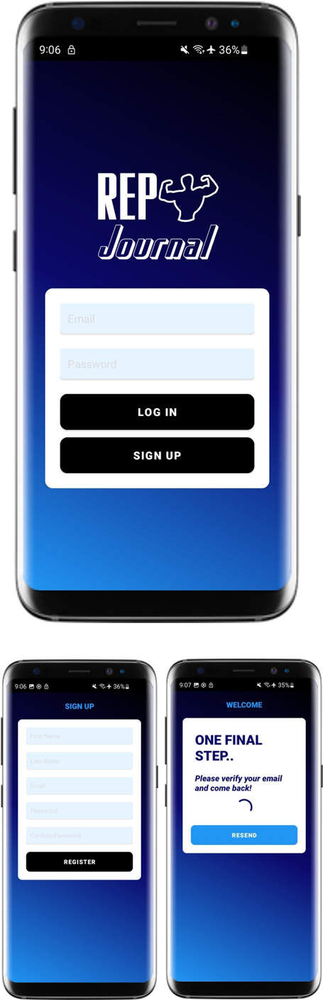
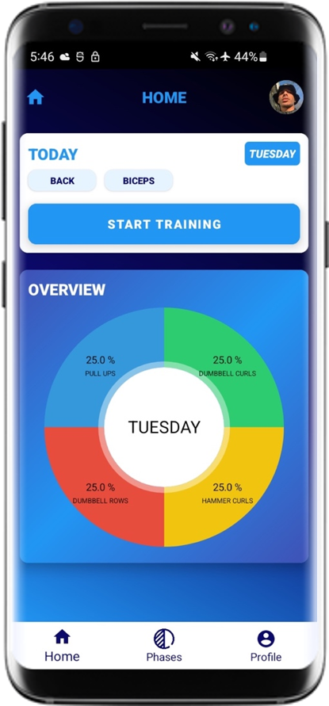
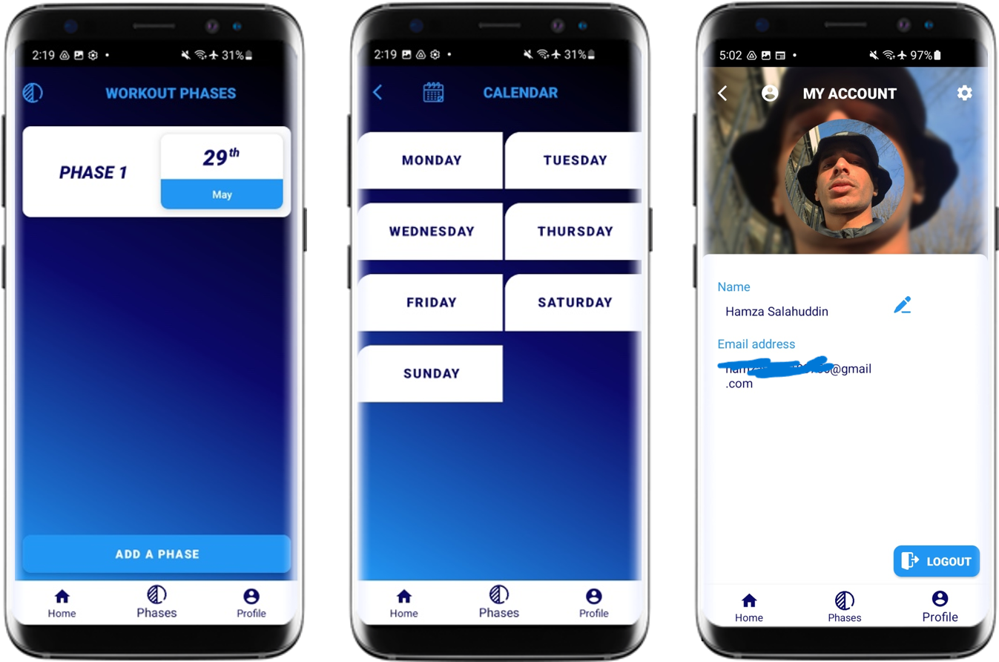
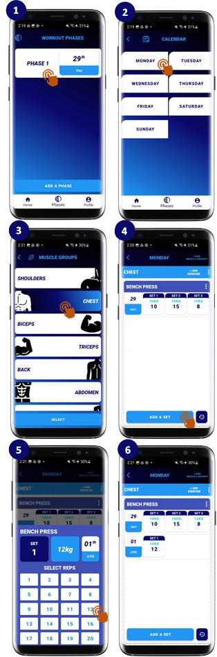
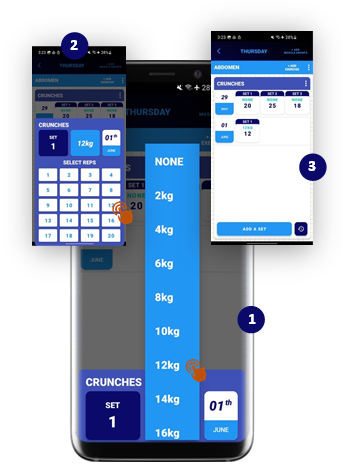
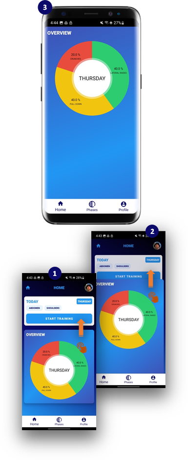

# RepJournal

## Overview
## Key Features
## Tech Stack

## Screenshots

The screenshots below show the main user journey in RepJournal, from authentication through to workout planning, exercise logging and progress visualisation.

### App Preview

RepJournal opens into a mobile-first workout dashboard where users can view their current training day, selected muscle groups and weekly exercise distribution.

  

---

### Authentication Flow

Users can create an account, log in and verify their email before accessing the main application. Firebase Authentication is used to manage account creation, login and verified access.

  

---

### Home Dashboard

The home screen shows the user’s current workout day, planned muscle groups, a start training action and a visual overview of the week. The bottom navigation provides quick access to Home, Phases and Profile.

  

---

### Workout Phases, Calendar and Profile

Users can organise training into workout phases, select specific weekdays from a calendar-style view and manage their profile from the main bottom navigation.

  

---

### Exercise Logging Workflow

The main workout flow guides users from selecting a workout phase, choosing a weekday, selecting muscle groups, adding exercises and recording sets. This creates a structured route from planning to actual workout tracking.

  

---

### Set, Rep and Weight Entry

RepJournal includes a custom input flow for recording workout sets. Users can select reps, choose weight values and add set records quickly during a workout session.

  

---

### Dashboard Interaction and Progress View

The dashboard was designed with a clean visual layout and interactive behaviour. Users can scroll between the workout summary and progress chart while keeping the main training action accessible.

  

## Application Flow
## Firebase / Data Structure
## What I Built
## Recent Repository Cleanup
## How to Run Locally
## Future Improvements
## Author
